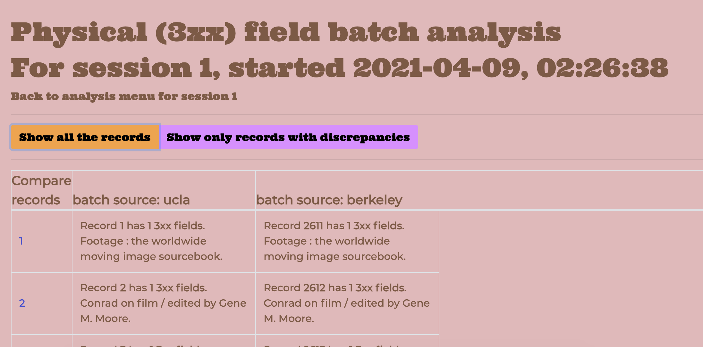
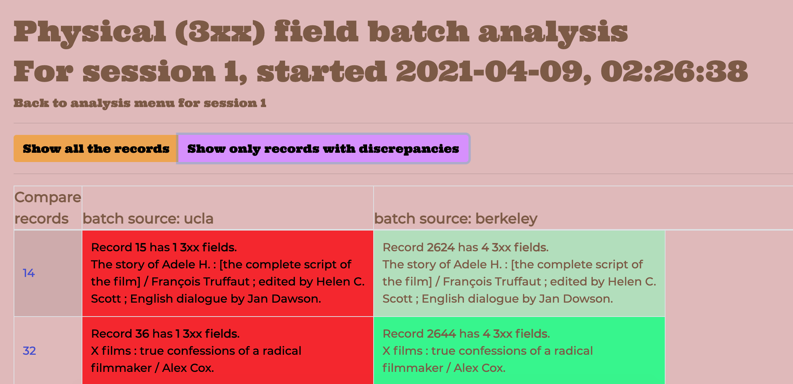
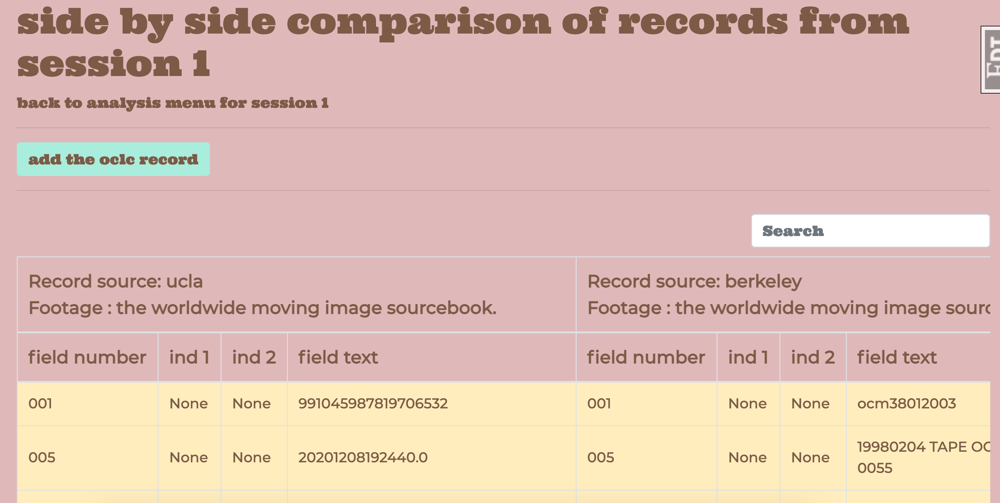
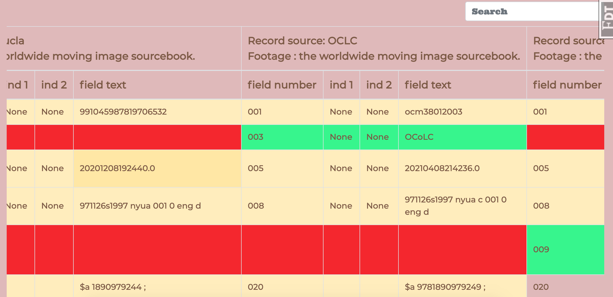

# MARCompare

This is a Flask-based webapp to compare MARC bibliographic records coming from (at least?) two different sources. It uses simple comparisons to point to which source has more data, which records are more complete, etc. For the moment the comparisons are simple "more is better" with visual cues to records with more data.


## Use case

The immediate use case is the UC Systemwide ILS (Integrated Library System a.k.a. [SILS](https://libraries.universityofcalifornia.edu/sils)) where records from all University of California campus libraries will be joined in a single catalog, using Alma's ExLibris product. In some cases, bibliographic records from one campus may be more complete or more detailed than records from another campus that match on OCLC number.

My hope is that this will help us in the post-migration cleanup that each campus will have to engage in.

## Input and processing

MARC files are uploaded as JSON files created by [MARCEdit](https://marcedit.reeset.net/), and must have originated as MARC XML files. This means for example that if the source file is a `.mrc` file it needs to be converted to XML and then to JSON. Since MARC files can use many different notations for fields and tags this simplifies the data parsing by making MARCEdit conform each file to a common format.

While MARCEdit is consistent in conforming MARC XML files, on my system it isn't good at stripping namespaces from XML tags (e.g. `<marc:record>` vs `<record>`). You need to tell the tool whether to expect namespaces in each file, and also where to look for the OCLC number (`001` or `035`; I might also add `019` to capture former OCLC numbers but the records I have don't tend to include these).

You can also note the source of each batch (e.g. "UCLA" and "BERKELEY"), and also make a note about the comparison "session." For example, if you are only inputting a subset of records, you can say "This set is restricted to books published between 1600 and 1750."


## Analyses


The first analysis that needs to be run is the "Overall" batch comparison, which parses the entire JSON dataset and does the rote tallying of field counts and so on (as Python dictionaries). After this is run, the more detailed analyses are available.


More detailed analyses by batch include comparisons of records by field set, for example 1xx fields (author information) or 6xx fields (subject headings).

You can view all the records listed by batch, or filter out just the ones that have a difference in the number of fields in the chosen field set.






You can then drill down into an individual matching set of records to look at the differences between specific records.




If you would like, you can also click on the "Add the OCLC record" button to pull down the current OCLC main record using a Z39.50 query. This requires credentials with OCLC, FYI.



## Next steps

I'd like to figure out how to make more nuanced analyses, going beyond just "more is better." Some of my colleagues at UC Berkeley pointed this out right away, and I agree. One feature in the works is the ability to add a custom analysis to the "menu" for each session, where you can stipulate a field you are interested in (for example `040`) and perhaps a particular value (`rda` or another description standard).

## Other technical details

The records and fields are stored in a SQLite database locally. A good chunk of the tallying is done in pure Python to save on processing overhead, but there are some queries to the database that can take a minute to complete depending on the size of your set. The 5,200 records in the session screengrabs here were processed in about 1.5 minutes on a pretty average Macbook.

## Dependencies

* Flask and related packages:
	* `pip3 install flask flask-sqlalchemy flask-wtf flask-login flask-bootstrap flask-migrate sqlalchemy wtforms email_validator wtforms_sqlalchemy`
	* optionally: `flask_debugtoolbar`
* For OCLC Z39.50 querying (optional?):
	* [MarcEdit](https://marcedit.reeset.net/)
	* `yaz`
		* `brew install yaz`

## Setup details

* clone this repo
* create these files based on the samples here:
  * `config.py`
	* `instance/config.py`
	* `app.db` (this can just be an empty file)
* run `flask db upgrade`
* Create a user for yourself:
  * run `flask shell` then in the interactive shell:
  * ```
	>> from app import db
	>> from models import User
	>> new_user = User(username='Jane',email='jane@email.com',password='password')
	>> db.session.add(new_user)
	>> db.session.commit()
	```
* Log in and you should be good to go


To dos:

- [x] add handling for different MARC JSON formats (i.e. how tags/subfieds are arranged & labeled)
- [x] add different OCLC number match points (035, 001) and maybe offer a checkbox for each uploaded file for the user to specify where to look for OCLC#?
- [ ] add private/public session distinction? so people can share sets? or to add a "sample" set.
